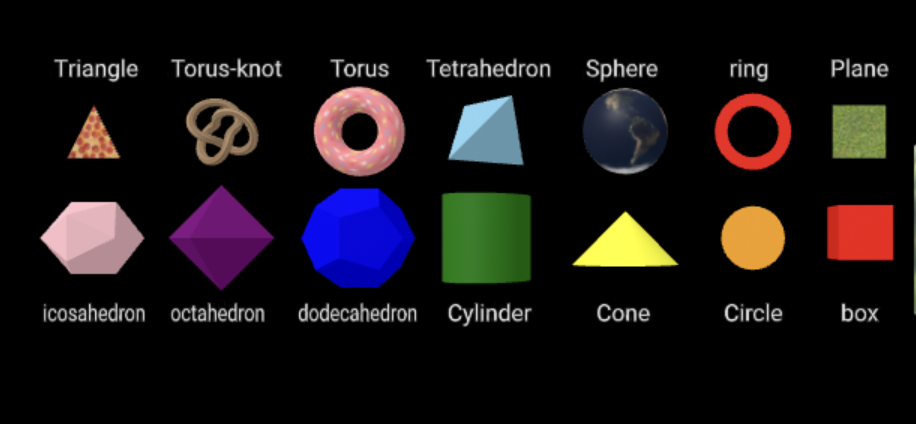

# Entry 5
##### 4/8/24


### Context
After choosing to use Aframe as my tool for my website, I now have to learn how to use it.

---

### Tinkering with Aframe:

#### Learning the shapes and how to apply text

- I first went to [Arame.io](https://aframe.io/docs/1.5.0/components/geometry.html) and put each shape on my scene. To add the shapes I had to use `<a-(name-of-shape)>`.

*code to add a box*

```html
  <a-box position="-20 0.5 -3" rotation="0 0 0" scale=" 5 5 5" color="red"></a-box>
```

- Then I added labels to each shape by using the `<a-text>` tag.

*example*

```html
 <a-text value="box" scale="10 10 5" position="-22 -7 -3"></a-text>
```



#### Applying images

To help me learn how to use images, I tried to look up a guide. After looking up "how to use images on aframe html" on youtube, I found this [video](https://www.youtube.com/watch?v=tzI5tu-0nm0).

-  I first tried to find a image for the sky background and grass floor. After that I used `<a-assets>` to create an id for each image, here's the code:

```html
    <a-assets>
        
        
      </a-assets>
```

- Then I applied these images on to the sky and ground:


```html
    <a-plane material="
         repeat: 5000 5000;
          normal-texture-repeat: 5000, 5000;
           color: FFFFFF;" src="#grass" rotation= "-90 0 0" scale= "1000 1000 1"></a-plane>

      <a-sky src="#sky"></a-sky>
```
After I did all of that, this is what I ended up with:


#### Adding textures

To learn how to add textures I also looked up a guide. This is the [video](https://www.youtube.com/watch?v=klnwT3vGCPw) I found which teaches you how to create Earth using a-frame.

- First I created a sphere by using `<a-sphere>`

- Then I added the texture of Earth to the sphere by using `src=”the-url”`. I got the Earth texture from [aframevr/sample-assets](https://github.com/aframevr/sample-assets). I also used `segments-height=""` to polish the Earth.

```html
   <a-sphere src="https://raw.githubusercontent.com/aframevr/sample-assets/master/assets/images/space/earth_atmos_2048.jpg" position="0 2 -6" radius="2" segments-height="60"> </a-sphere>
```

*Image of my A-frame*


#### Animations

I learned about creating animations on aframe by first reading the DOC on [aframe.io](https://aframe.io/docs/1.5.0/components/animation.html) and then creating a sphere that orbits. Here is the code I used:


```html
 <!-- Earth -->
  <a-sphere
    position="0 0 0"
    src="https://raw.githubusercontent.com/aframevr/sample-assets/master/assets/images/space/earth_atmos_2048.jpg"
    radius="14"
    animation="property: rotation; to:0 360 0; ease:linear; dur:9500; loop:true;"
  ></a-sphere>


  <!-- Moon -->
  <a-entity rotation="0 0 0" animation="property: rotation; to: 0 360 0; loop: true; dur: 7000">
      <a-sphere
        position="5 0 -55"
        src="https://t3.ftcdn.net/jpg/00/81/29/74/360_F_81297447_kfFfYem0dWGkQRL8hNhA0nIOYvrBQft0.jpg"
        radius="2"
        animation="property: rotation; to:0 360 0; ease:linear; dur: 9000; loop:true;"
      ></a-sphere>
  </a-entity>
```

- `<a-entity>`

  This used to make placeholder objects that you can plug components into and provide them with different appearances, behavior, and functionality.

- `<a-entity rotation="0 0 0" animation="property: rotation;">`

  This creates an animation where an object orbits or rotates around something.

    I used these to create the Earth with the moon orbiting it.


#### Interactive scene

I created an interactive scene by making text appear when you hover over an object.

- I first used `<a-camera> <a-cursor></a-cursor> </a-camera>` which creates a cursor on the center of your screen and lets you interact with things. This will allow users to hover the cursor over the object.

  ```html
    <a-torus
      event-set__enter="_event: mouseenter; _target: #donutText; visible: true"
      event-set__leave="_event: mouseleave; _target: #donutText; visible: false"
      >
    ```

- Then I created the text that will appear by using `<a-text>`

*The full code*
```html
 <a-scene>
      <a-torus
        position="1 0.75 -3" radius="0.5" height="1.5"
        event-set__enter="_event: mouseenter; _target: #donutText; visible: true"
        event-set__leave="_event: mouseleave; _target: #donutText; visible: false"
        src="https://www.shutterstock.com/image-vector/cake-glaze-colorful-seamless-pattern-600nw-277068518.jpg">
        <a-text id="donutText" value="This is a donut" align="center" color="black" visible="false" position="0 -0.5 1"
        geometry="primitive: plane; width: 1.75" material="color: pink"></a-text>
      </a-torus>

        <a-camera>
          <a-cursor></a-cursor>
        </a-camera>
    </a-scene>
```


#### Importing custom models

I learned how to import custom 3D models into my scene by following [this guide](https://www.youtube.com/watch?v=eqiH5_CZDO0) on youtube and reading the [aframe.io](https://aframe.io/docs/1.5.0/primitives/a-gltf-model.html) website.

-  First I went to [sketchfab.com](https://sketchfab.com/feed) and downloaded [the gltf (3D model)](https://sketchfab.com/3d-models/robot-victor-gonzalez-8737e5f54f454a01a15fe54c0e4843f3) which was a robot and I Imported the folder with the glft into my IDE.

- Then I used `<a-assets>` to create an ID for the gltf.

```html
    <a-assets>
    <a-asset-items id="robot" src="gltf/scene.gltf"></a-asset-items>
    </a-assets>
```

- `<a-gltf-model src="">` is used to display custom 3D models


---

[Previous](entry04.md) | [Next](entry06.md)

[Home](../README.md)
