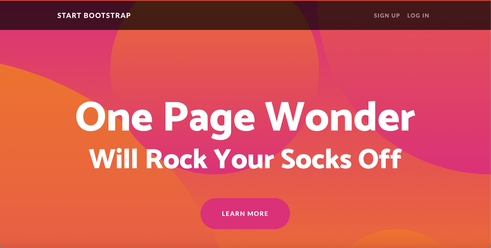
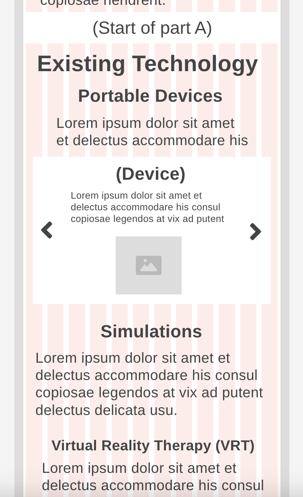

# Entry 6
##### 5/1/24

### Context

Now that I have finished learning [aframe](https://aframe.io/), I now have to complete the next step in the [Engineering Design Process (EDP)](https://hstatsep.github.io/students/#edp), which is creating a prototype.

### Creating the Website layout

Before I started making the website, I made a layout of it by using [wireframe.cc](https://wireframe.cc). I created two different layouts, one for mobile and one for desktop.

* [Mobile layout](https://wireframe.cc/aMMiUN)
* [Desktop layout](https://wireframe.cc/U17GwI)

### Creating the Minimum Viable Product (MVP)

#### Bootstrap template
For my website I used a bootstrap template. The template I chose was the [“One Page Wonder”](https://startbootstrap.com/theme/one-page-wonder) template because I liked the transparent navbar and the background circles in the header. I also liked how simple it was and it was a template that I could easily change and add on too.



#### Navbar and Title

Since I already had a transparent navbar and title from the template all I had to do was change the information on the navbar and the color of the title.


### Skills

Some of the skills that I learned while creating my MVP was **organization** and **consideration**.


#### Organization
While completing the MVP I had to do a lot of organization. For example, when I created my wireframes I added labels to show where my content will be and which components to use.



I also organized my code by adding titles to help me know what part of my website it was for.

```html

<!-- Navigation  -->
<nav> code for navbar </nav>

<!-- Header -->
<header> Code for my heading/title </header>

```

#### Consideration
Another skill that I learned was attention to detail. When I was making my website I wanted to get rid of any errors or problems that it had. To do this I had to pay attention to all the little things in my code to make sure there weren't any errors. For example, there was one time where my heading wasn’t working.

```html
<!-- code with the errors -->
 <header class="masthead text-center text-white>
          <div class="masthead-content">
              <div class="container px-5">
                  <h1 class="masthead-heading">Mental health Care</h1>

              </div>
          </div>
          <div class="bg-circle-1 bg-circle"></div>
          <div class="bg-circle-2 bg-circle"></div>
          <div class="bg-circle-3 bg-circle"></div>
          <div class="bg-circle-4 bg-circle"></div>
      <header>

```
After analyzing my code I realized that my code wasn’t working because I forgot to put a quotation mark at the end of the class in the `<header>` element. Also, I forgot to put the slash in the `</header>` at the end of the code.

### Takeaways
Creating my MVP has shown me the importance of being organized and observant. Without these skills completing this website will be way more difficult. I am excited to use these skills to complete the next step in completing my project.


[Previous](entry05.md) | [Next](entry07.md)

[Home](../README.md)
