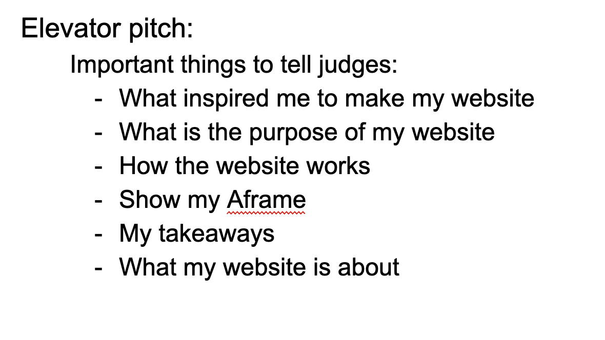

# Entry 7
##### 5/21/24

### Context

After completing the prototype of my website I will now move onto the next step of the [Engineering Design Process (EDP)](https://hstatsep.github.io/students/#edp) which is to improve on my prototype.

---

### Improving my Project

In order to improve my website I had to see what others thought of it first. In my SEP10 class I had my classmates writedown the “glows” and the “grows” of my website into my [SEP10 notes](https://docs.google.com/document/d/1VJAFMl0TMxN4vRm5UKcsslsPzSIqfxj898Kzt64-n4E/edit). The “glows” are the strengths of my project and the grows are feedback for where my website can improve. Then I use this feedback to help me improve on my website. For example, my classmate Caleb pointed out how the arrow to change slides on the carousel was difficult to see when on the “Smartwatch” slide. So to fix this I changed the image of the smartwatch to an image with a brighter background to make the arrow more visible.

---

### Presenting my project
After improving and finishing my project I now had to present it to other people. There were two types of presentations I did which were the classroom presentation and the elevator pitch. To prepare for these presentations I created a plan inside of my [SEP10 notes:](https://docs.google.com/document/d/1VJAFMl0TMxN4vRm5UKcsslsPzSIqfxj898Kzt64-n4E/edit)

#### Classroom Presentation

For my classroom presentation I had to create google slides to explain the content in my website and the process I took to create it. The first thing I did was plan out the presentation, here was the plan I made:

* Hook:
    * Statement about mental health
        * Mental health problems are a struggle many people have.

    * Something to follow up my statement: There are many ways people can treat their mental health.

* Product:
    * link to my website
    * Explain content
    * Show components and aframe

* Process:
    * Explain how I learned my tool
        * Show how I tinkered and researched my tool
    * Show how I planned the website (wireframe)
    * Explain the bootstrap components and template I used
        * Code snippets
        * Aframe code
        * Carousel code

* Conclusion:
    * Takeaways from making my website
        * Time management
        * Have a plan
        * Be organized

After creating this plan, I started making my slides. The first slide would just be a title with the words “Mental Health Care” and my name. The second slide will be the hook or the thing to get the audience's attention. The hook I created was from my plan which was just a statement about mental health and the ways to treat it. The next slide would have the link to my website and once I was on the website I showed the audience all of the components and content on there. The next few slides will all explain the process I took to make my website such as learning my tool, planning the layout of my website, how I made certain bootstrap components, and how I used my tool(Aframe) on my website. The last slide were all the takeaways I had from completing my project such as time management, planning, and organization. To end my presentation I thanked the audience for listening and asked them if they had any questions.

#### Takeaways from in class presentation:
* Speak loud and clearly
    * Speaking clearly for the audience is important because it helps them easily understand the things you’re saying to them.
    * Speaking loud, but not too loud, makes it easier for people to hear you even if they are in the back of the room

* Be considerate when creating your presentations
    * Something I tried to do was be mindful of the fact that other people would be seeing my presentation from many different spots in the room. Some things I did to make everything easier for the audience to see was make the font sizes and images bigger.

* Be more presence
    * After my class finished their presentations my teacher gave us feedback to help us improve on our presenting skills. The feedback he gave me was to engage with the audience more by making more eye contact. In the future I will try to work on having more presence and being more engaging when presenting.

[Link to my presentation](https://docs.google.com/presentation/d/10460DbshnOYCZaMcVqaddVlEkeBA2H3TEwLyCyNXyYo/edit#slide=id.p)

#### Elevator pitch

Unlike the classroom presentation, for my elevator pitch I only had 1 minute to show off my website and 30 seconds for questions. I would be giving this elevator pitch to judges and also to other students, since I only had a minute to present I had to create a plan. So the first thing I did was list the things that would be important to tell the judges.

The next thing I did was make a script with all the important things from the list to tell the judges. Here is what I wrote:

"Hello, would you like to check out my project? My project is a website about mental health care and I created this to hopefully help people find new ways to treat their mental struggles. There are two parts to my website: the first part showcases the technology that already exists such as portable devices, simulations, and apps. And the last part, which is at the bottom, shows the future technology that I came up with. In the last part of my website there is a 3D model for one of my ideas that you can interact with. The purpose of this 3D model is to give users a preview of how the comfort robot might look like if it was created. Here is the code I used to create my project, do you have any questions?"

The day before the expo I practiced saying my elevator pitch to the class. While practicing there would be a 1 minute timer and I practiced saying everything I wanted to in that amount of time. This practice would be very helpful because when I presented to the judges I was already prepared and it made me less nervous about presenting.

When the judges came up to me I followed my plan but I think I could’ve spoken more clearly and maybe engaged with them more but other than that it went well.

#### Elevator Pitch Takeaways
* Have a plan
    * Without a plan presenting my website to the judges would’ve been way more difficult

* Practice
    * Practicing made it easier for me to present since I was already use to giving my elevator pitch

* Be confident
    * Having confidence can make your presentation sound better to your audience

---

[Previous](entry06.md) | [Next](entry08.md)

[Home](../README.md)
