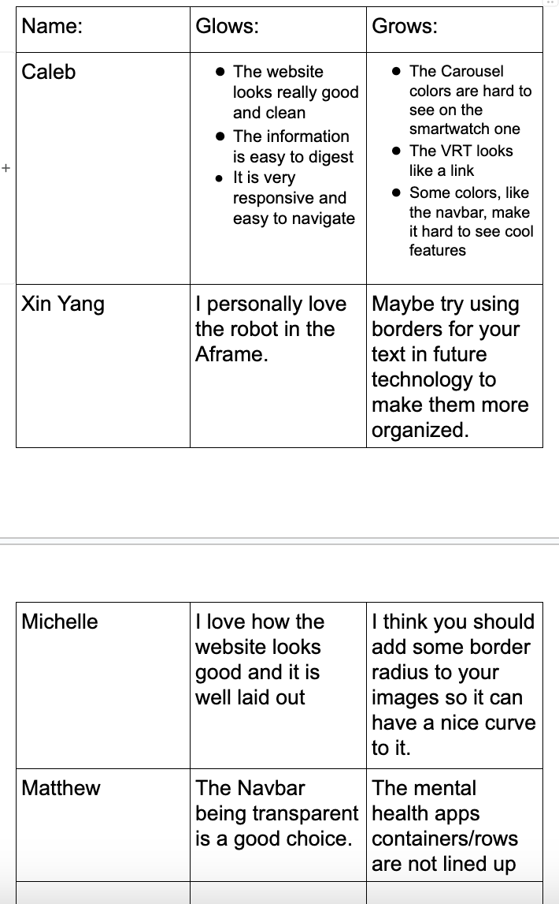

# Entry 7
##### 5/21/24

### Context

After completing the prototype of my website I will now move onto the next step of the [Engineering Design Process (EDP)](https://hstatsep.github.io/students/#edp) which is to improve on my prototype.

---

### Improving my Project

In order to improve my website I had to see what others thought of it first. In my SEP10 class I had my classmates writedown the “glows” and the “grows” of my website into my SEP10 notes. The “glows” are the strengths of my project and the grows are feedback for where my website can improve. Then I use this feedback to help me improve on my website. For example, my classmate Caleb pointed out how the arrow to change slides on the carousel was difficult to see when on the “Smartwatch” slide. So to fix this I changed the image of the smartwatch to an image with a brighter background to make the arrow more visible.

#### Takeaways

[Previous](entry06.md) | [Next](entry08.md)

[Home](../README.md)
