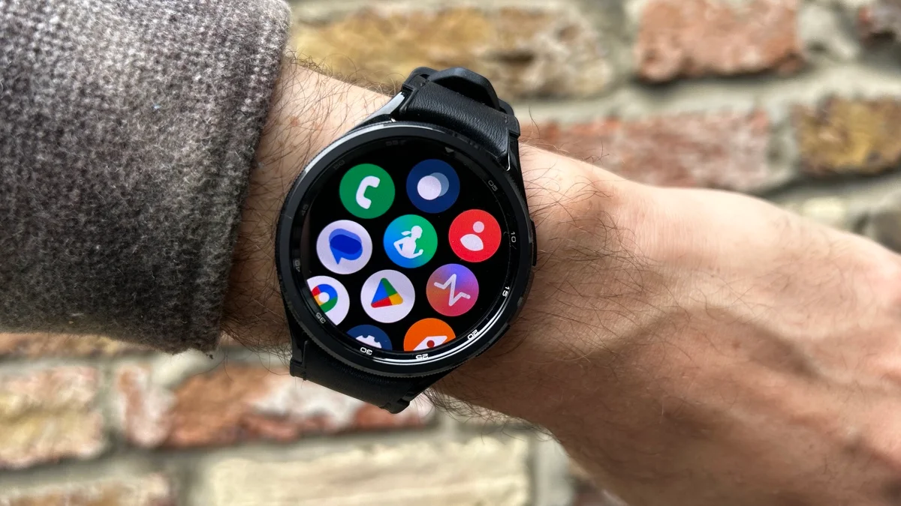

# Content
Topic: Mental Health Care

## Overview/Introduction/Context
* Throughout time, mental health issues have caused trouble to many people.

* Even though the problems take place inside of the mind, there is technology that can help with treating mental issues.

* This site will look at the technological innovations of mental health care, and possible treatments that could be used in the future.

## Part A: existing technology
### Portable devices:
 You can bring these devices anywhere.

* #### Smartphones:

  * Smartphones give you access to many mental health care apps and sources.

* #### Smart Watches:
  * A wearable device that gives you easy access to mental health care apps.

  

  * #### Abilify MyCite
    * A pill with a sensor inside that tracks drug ingestion, it is also used to treat schizophrenia.

## Part B: possible future technology
* Idea
  * Detail

