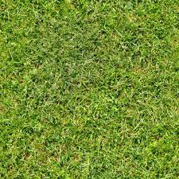
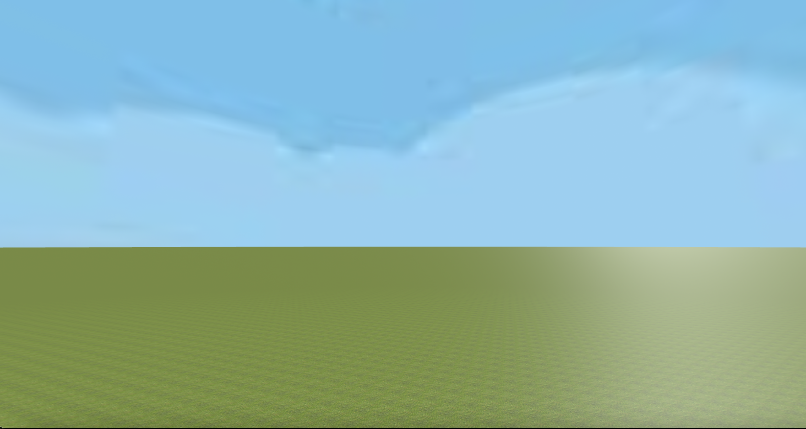

# Tool Learning Log

Tool: **Aframe**

---

### 2/26/24:
* I first copy and pasted code from [aframe.io](https://aframe.io/docs/1.5.0/introduction/) into my aframe.html, and then I tried to figure out how the shapes moved. I did this by adding 4 boxes and changing the positions in the code to see where and how it would move. I also used the shapes to create a square head with a face.

---

### 3/4/24:
* I wanted to learn how to use images on Aframe, so I tried to find a guide. After looking up "how to use images on aframe html" on youtube, I found this [video](https://www.youtube.com/watch?v=tzI5tu-0nm0). I first tried to find a image for the sky background and grass floor. After that I used `<a-assets>` to create an id for each image, here's the code:
    ```html
    <a-assets>
        
        
      </a-assets>

    ```
    Then I applied these images on to the sky and ground:
    ```html
    <a-plane material="
         repeat: 5000 5000;
          normal-texture-repeat: 5000, 5000;
           color: FFFFFF;" src="#grass" rotation= "-90 0 0" scale= "1000 1000 1"></a-plane>

      <a-sky src="#sky"></a-sky>
    ```
    After I did all of that, this is what I ended up with: 

---


### 3/11/24:

 I was interested in learning how to add textures to my scene so I looked up a video that demonstrates how to use textures. This is the [video](https://www.youtube.com/watch?v=klnwT3vGCPw) I found which teaches you how to create Earth using a-frame.

 * I first changed the A-frame version to match the one in the video since the code doesn’t work in the current version. `<script src="https://aframe.io/releases/1.5.0/aframe.min.js"></script>` ----> `<script src="https://aframe.io/releases/0.5.0/aframe.min.js"></script>`


* Then I created a sphere that has the texture of Earth using `src=”the-url”`. I got the Earth texture from [aframevr/sample-assets](https://github.com/aframevr/sample-assets). I also used `segments-height=""` to polish the Earth.


```html
   <a-sphere src="https://raw.githubusercontent.com/aframevr/sample-assets/master/assets/images/space/earth_atmos_2048.jpg" position="0 2 -6" radius="2" segments-height="60"> </a-sphere>
```

* Even though I wanted to learn textures, I also learned how to make animations. This is the code I used to make the Earth spin:
```html
 <a-animation attribute= "rotation"
        dur="10000"
        to= "0 360 0"
        ease="linear"
        repeat="indefinite">
      </a-animation>
```
 `dur="10000` makes the animation cycle last for 10000 milliseconds


 `to= "0 360 0"` changes the value of the sphere at the end of the animation

 `ease="linear"` makes the speed of the animation constant

 `repeat="indefinite"` makes the animation repeat infinitely


<!--
* Links you used today (websites, videos, etc)
* Things you tried, progress you made, etc
* Challenges, a-ha moments, etc
* Questions you still have
* What you're going to try next
-->
